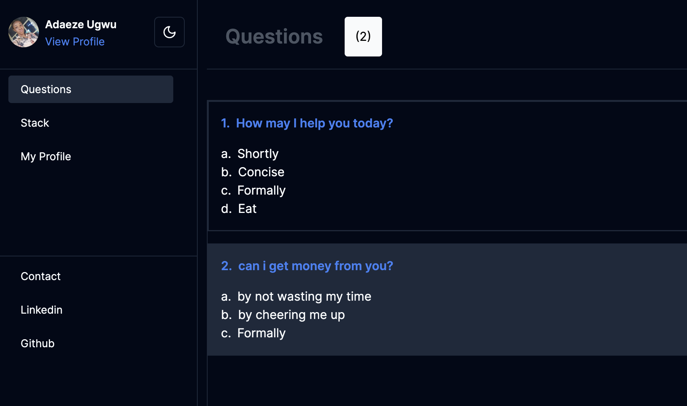

<h1>Question Time Web Platform</h1>
<h6><i>Enjoy your Question Management Schedule with the application</i></h6>

Hello, 👋 \
Question Manager Application allows user perform CRUD (Create, Read, Update and Delete) Operation.

Here's some notes about my submission:

1. A link to the project repository https://github.com/itsadaeze/question-time-app

2. A publicly live hosted URL of the challenge https://question-time-app.vercel.app/

Thank you very much.

Best regards\
Adaeze Ugwu

# Technologies

- [JavaScript](https://javascript.info/)
- [NextJs](https://nextjs.org/)
- [Vercel](https://vercel.com/dashboard)
- [React Hook-form](https://react-hook-form.com/)
- [TailwindCss](https://tailwindcss.com/)

# Prototype

# How to Contribute

1. Clone the repository
   $ git clone [https://github.com/itsadaeze/question-time-app](https://github.com/itsadaeze/question-time-app.git)

2. Change directory into the cloned folder and run the setup script
   $ cd task

3. Open your terminal and type this command  `npm install` to add the react dependency to the app in the development mode.

4. Then after the installation of the dependency type this command `npm run dev` to run the app in your local environment

5. Copy this link [http://localhost:3000/](http://localhost:3000/) and paste it to your web browser(Chrome, safari, mozilla firefox et.c) to view it.

# Deployment

Vercel was used to deploy the app.

- [Vercel](https://vercel.com/dashboard)

# License

The MIT License - Copyright (c) 2024 - Present, itsadaeze/ Storage Service.

# Author

Adaeze Ugwu (Frontend Developer)
